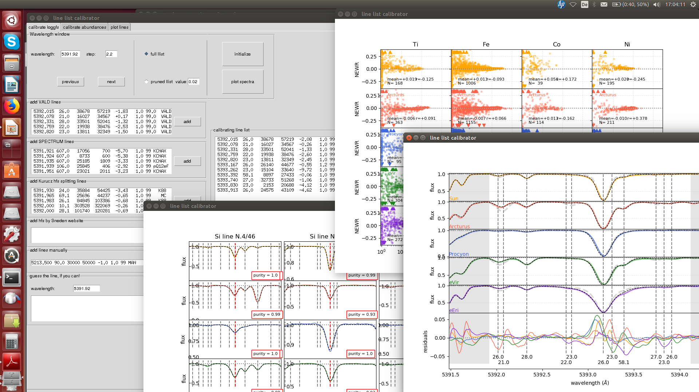
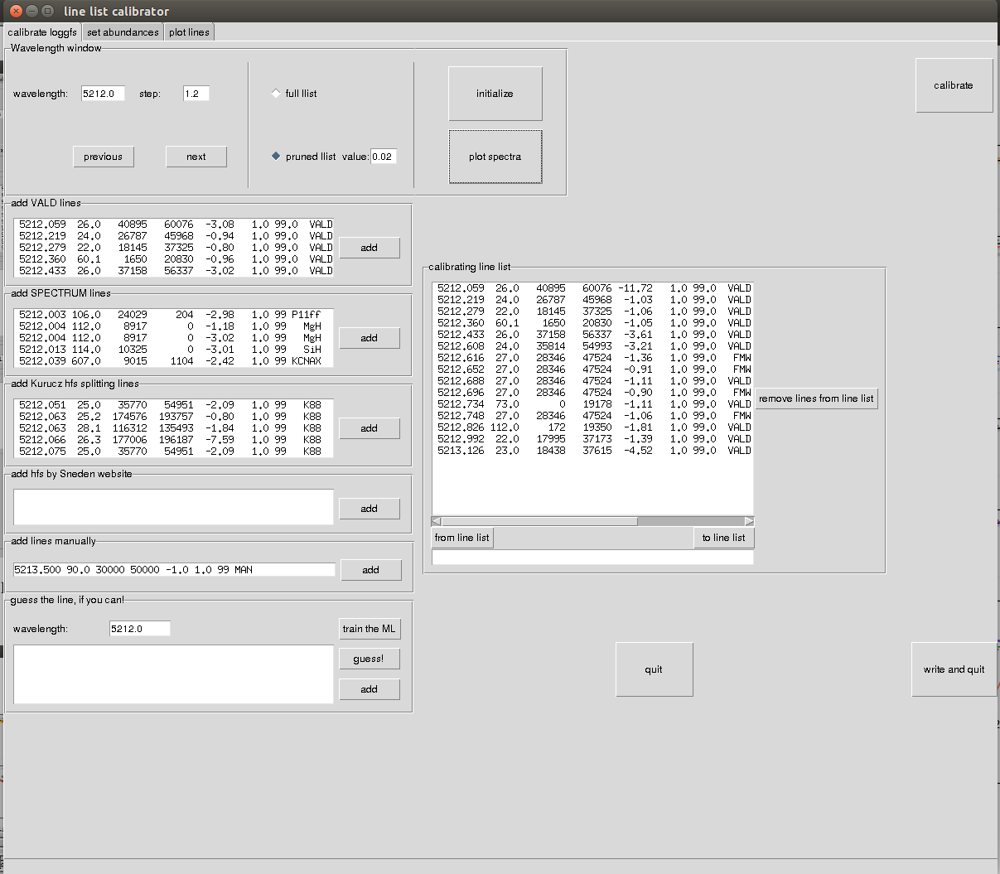
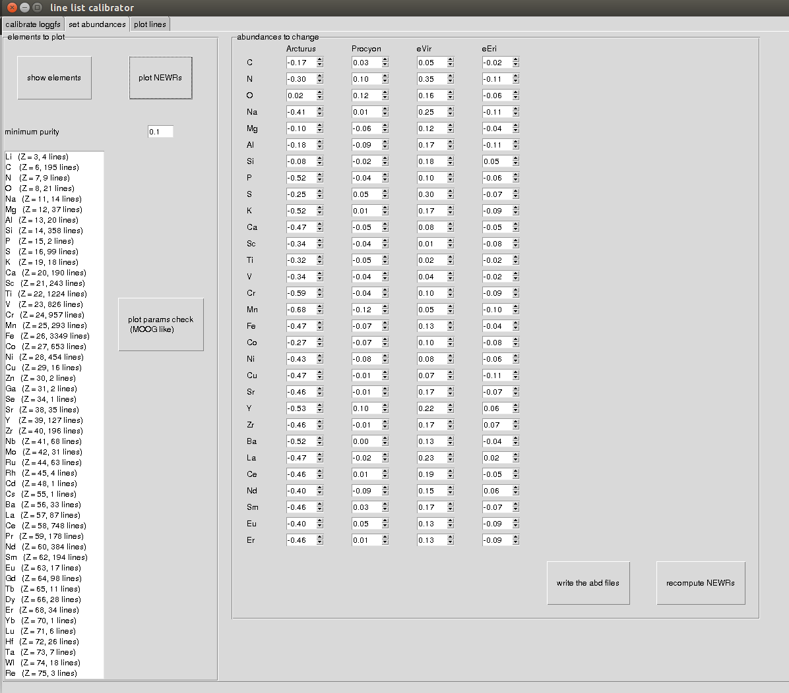
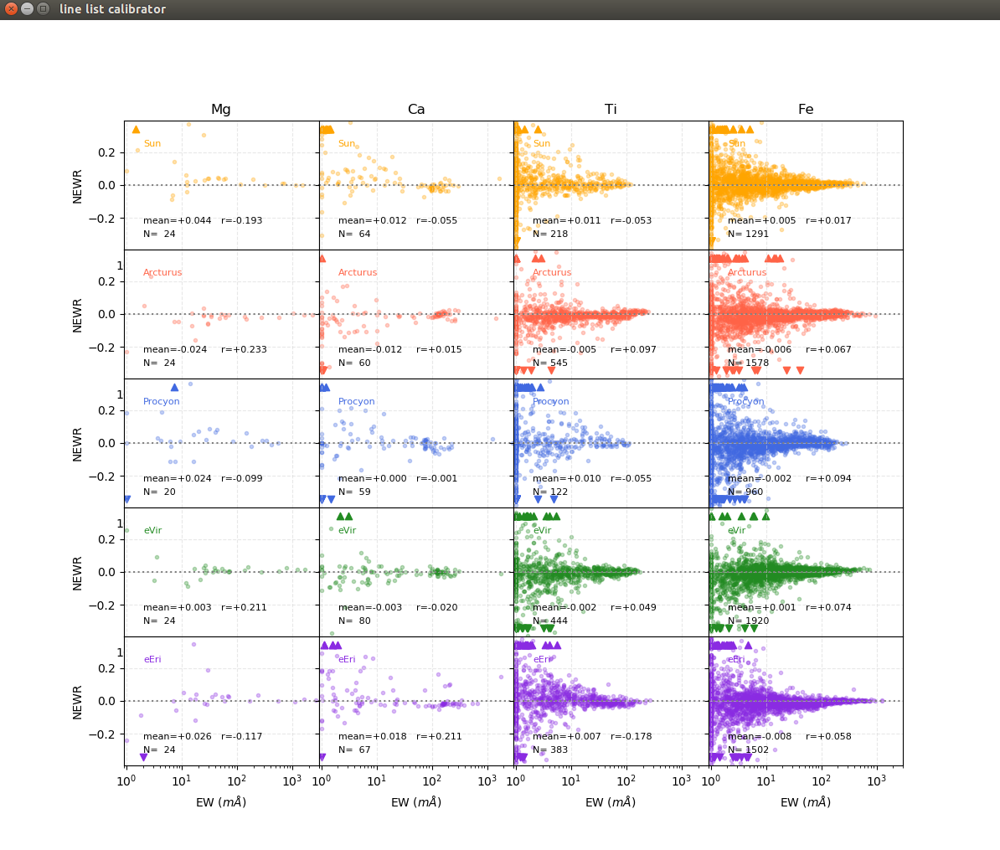
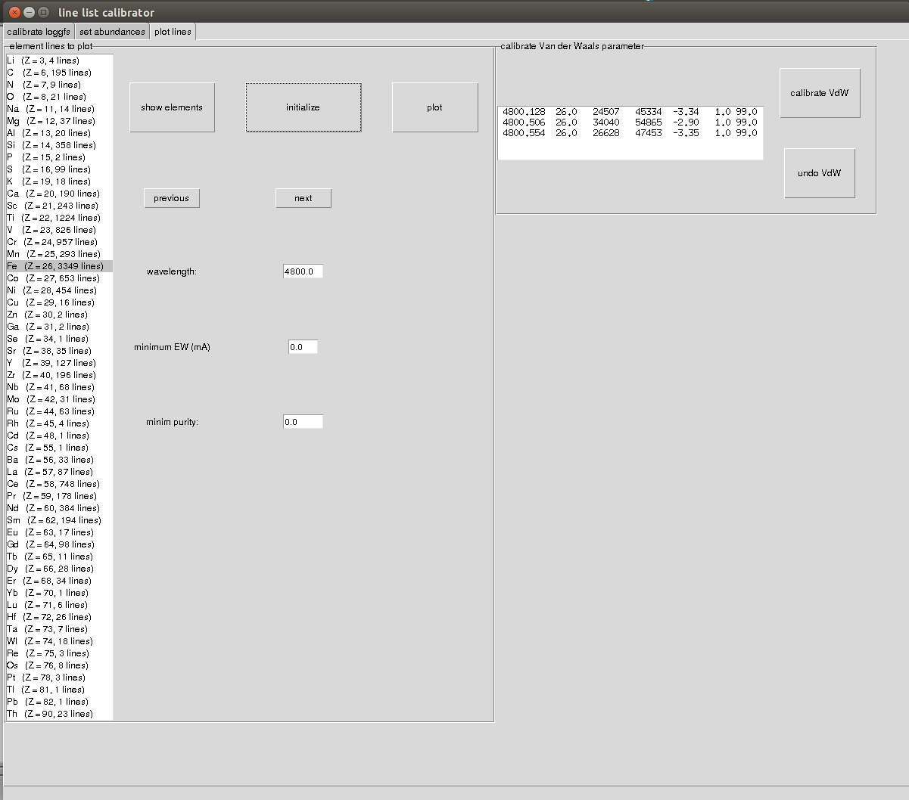
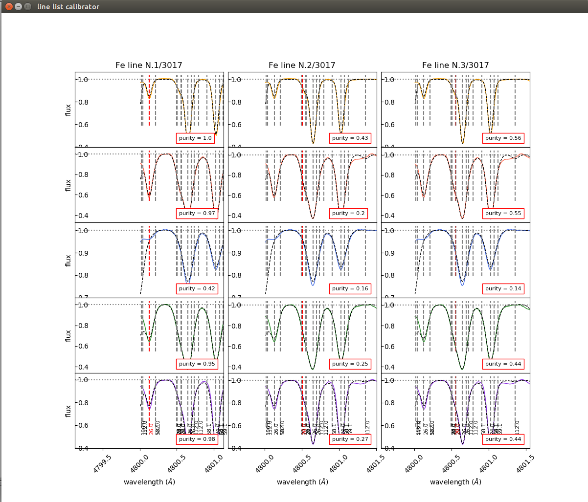

# Transition probability calibrator

This software is a semi-automated tool to perform astrophysical calibration
of atomic transition probabilities to be used in stellar spectra synthesis.
It has been used to create a astrophysically calibrated atomic line list
for the creation of the General Curve of Growths (GCOGs) library necessary for the
[SP_Ace software](http://dc.g-vo.org/SP\_ACE).

It is ``semi-automated" because the calibration process is performed
interactively. The used can check the calibration for small wavelenght
intervals step by step, or run it in batch mode. The results can be
visualized and the lines can be added, removed, or modified by the user.

## Disclamer

Although the software is released under GLP licence, the version here
presented miss of some fundamental data necessary to make it run. I decided
to not put here the data because, although these are public data, they do
not come from my work. Therefore, if anybody download this software and run it, it
will not work. If you are interested to run it, please contact
me privately.

## Usage
I give here a short explanation only (please see the tutorial [here](manual/tutorial.pdf)
for details). The code has been designed to standardize and make user friendly the
calibration process. From the graphic user interface (GUI) the
user can check and control the whole process.

From the "calibrate_loggfs" tab, the user can select the wavelenght interval, see which lines are present, remove or add new lines. By pressing initialize and plot the user can see the five standard spectra plotted in the chosen window together with the synthetic ones. By clicking on "calibrate" the calibration process will start and, when finished, the new transition probabilities will be shown in the right window together with the freshly synthesized spectra. The button "next" will move the wavelength interval forward by the quantity chosen.

From the "set abundances" tab the user can see on the left hand side how many lines belonging to which chemical element are available. On the right one ca set the chemical abundances individually for each standard stars. By pressing "plot NEWRs" the user visualize the following

which shows the "Normalized Equivalent Width Residuals" (NEWR) for each absorption line up to four elements together.

From the "plot lines" tab the user can inspect any lines that may be of interest, performing an automated calibration of the Van der Waals parameter (which rules the width of the line).

By clicking on the "plot" button, one can visualize the neighboring spectrum, its "purity" value and calibrate the Van der Waals parameter which rules the width of the line.

# References
This tool has been used to produce the GCOG library for the software SP_Ace. The work by Boeche C., Vallenari A., and Lucatello S. has been published in [Astronomy & Astrophysics, 645, 35, 2021](https://ui.adsabs.harvard.edu/abs/2021A%26A...645A..35B/abstract).
